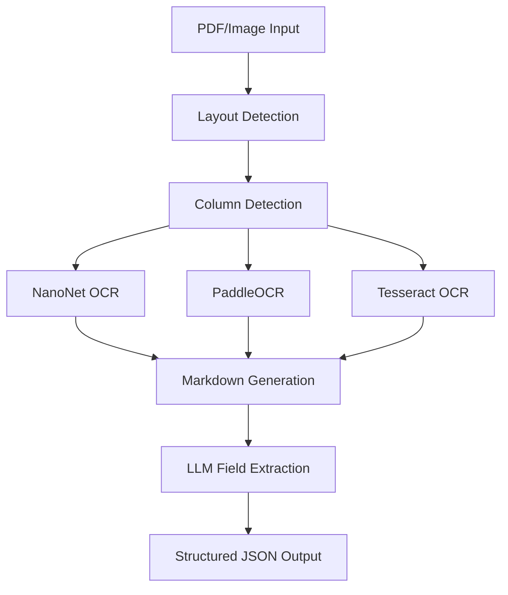

# 📄 Advanced OCR Document Processing Pipeline

A comprehensive suite of Jupyter notebooks for intelligent document processing, featuring advanced OCR engines, layout detection, and structured data extraction from invoices and documents.

## 🚀 Overview

This repository contains a complete pipeline for processing various document formats (PDF, TIFF, JPG) using state-of-the-art AI models to extract structured information. The pipeline focuses on invoice processing but can be adapted for other document types.

## 📊 Pipeline Architecture



## 📁 Project Structure

```
notebooks/
├── test_data/                          # Input documents (PDF, TIFF, JPG)
├── output_results/                     # Layout detection results
├── nanonet_markdown_output/            # NanoNet OCR markdown results
├── nanonet_json_output/               # Extracted structured data (JSON)
├── paddle_markdown_output/            # PaddleOCR markdown results
├── paddle_json_output/               # PaddleOCR extracted data
├── tesseract_markdown_output/         # Tesseract OCR markdown results
├── tesseract_json_output/            # Tesseract extracted data
│
├── pdf_image_layout_detection.ipynb   # 1️⃣ Layout analysis & element detection
├── nanonet_ocr_column_detection.ipynb # 2️⃣ NanoNet OCR with column detection
├── nanonets_ocr_markdown_generator.ipynb # Alternative NanoNet implementation
├── paddle_ocr_column_detection.ipynb  # 2️⃣ PaddleOCR with column detection
├── tesseract_ocr_pipeline.ipynb      # 2️⃣ Tesseract OCR processing
├── sagemaker_ocr_processing.ipynb     # High-performance SageMaker processing
└── invoice_llm_extraction.ipynb       # 3️⃣ LLM-based field extraction
```

## 🔧 Features

### 🎯 Core Capabilities
- **Multi-Format Support**: PDF, TIFF, JPG, JPEG, PNG
- **Advanced Layout Detection**: Using Docling AI models with reading order
- **Intelligent Column Detection**: Automatic 1, 2, 3+ column layout recognition
- **Multiple OCR Engines**: NanoNet, PaddleOCR, Tesseract comparison
- **Structured Data Extraction**: LLM-powered field extraction from invoices
- **GPU Acceleration**: CUDA support for high-performance processing

### 📋 Document Processing Features
- ✅ **Layout Preservation**: Maintains original document structure
- ✅ **Reading Order**: Intelligent left-to-right, top-to-bottom ordering
- ✅ **Column-Aware Processing**: Handles multi-column layouts accurately
- ✅ **Table Recognition**: Preserves table structure in HTML format
- ✅ **Image Handling**: Processes embedded images with descriptions
- ✅ **Watermark Detection**: Identifies and marks watermarks
- ✅ **Batch Processing**: Efficient processing of multiple documents

### 🤖 AI Models Used
- **Layout Detection**: Docling (Heron, Egret models)
- **OCR Engines**:
  - NanoNet (`nanonets/Nanonets-OCR-s`) - Vision-language model with context understanding
  - PaddleOCR - Production-ready OCR with high accuracy
  - Tesseract - Traditional OCR for comparison
- **Field Extraction**: NanoNet LLM for structured data extraction

## 🚀 Quick Start

### Prerequisites

```bash
# Core dependencies
pip install torch transformers pillow tqdm
pip install paddleocr paddlepaddle  # For PaddleOCR
pip install pytesseract              # For Tesseract
pip install docling                  # For layout detection

# Install Tesseract system dependency
# Ubuntu/Debian: sudo apt-get install tesseract-ocr
# Windows: Download from https://github.com/UB-Mannheim/tesseract/wiki
# macOS: brew install tesseract
```

### Usage Workflow

#### Step 1: Layout Detection
```python
# Run: pdf_image_layout_detection.ipynb
# Input: Documents in test_data/
# Output: Layout analysis with bounding boxes and reading order
```

#### Step 2: OCR Processing (Choose one or run all)
```python
# Option A: NanoNet OCR (Best quality, slower)
# Run: nanonet_ocr_column_detection.ipynb

# Option B: PaddleOCR (Balanced quality/speed)
# Run: paddle_ocr_column_detection.ipynb

# Option C: Tesseract OCR (Fastest, basic quality)
# Run: tesseract_ocr_pipeline.ipynb
```

#### Step 3: Structured Data Extraction
```python
# Run: invoice_llm_extraction.ipynb
# Extracts: invoice_number, invoice_date, billing_address, total_amount
```

### Example Usage

```python
# 1. Process a single document through the complete pipeline
input_file = "test_data/invoice_sample.pdf"

# 2. Layout detection creates structured crops
layout_results = process_layout_detection(input_file)

# 3. OCR processes each crop with column awareness
ocr_results = process_with_nanonet_ocr(layout_results)

# 4. LLM extracts structured fields
structured_data = extract_invoice_fields(ocr_results)

print(structured_data)
# Output: {
#   "invoice_number": "INV-2024-001", 
#   "billing_address": "123 Main St\nNew York, NY 10001",
#   "total_amount": "$1,250.00"
# }
```


## 🎛️ Configuration

### Layout Detection Settings
```python
CONFIG = {
    'layout_model': 'heron',  # v2, heron, egret_medium, egret_large
    'enable_reading_order': True,
    'dpi': 300,
    'device': 'auto'  # auto, cpu, cuda
}
```

### OCR Processing Settings
```python
CONFIG = {
    'column_gap_threshold': 0.15,      # 15% for column detection
    'full_width_threshold': 0.7,       # 70% for full-width elements
    'confidence_threshold': 0.0,       # OCR confidence filtering
    'use_layout_reading_order': True   # Preserve reading order
}
```

### Field Extraction Settings
```python
CONFIG = {
    'model_path': 'nanonets/Nanonets-OCR-s',
    'max_new_tokens': 512,
    'device': 'cuda' if torch.cuda.is_available() else 'cpu'
}
```

## 📈 Performance Optimization

### GPU Memory Management
- **Single GPU**: 8GB+ recommended for NanoNet
- **Multi-GPU**: SageMaker g5.12xlarge support (4x A10G)
- **CPU Fallback**: All models support CPU processing

### Batch Processing
```python
# Process multiple documents efficiently
batch_results = batch_process_documents(
    input_dir='test_data/',
    output_dir='results/',
    engine='nanonet',
    batch_size=4
)
```

## 🛠️ Advanced Features

### Column Detection Algorithm
- **Gap Analysis**: Detects column boundaries using horizontal spacing
- **Element Clustering**: Groups content by spatial proximity
- **Reading Order**: Maintains natural reading flow
- **Full-Width Detection**: Identifies headers and footers

### Error Handling
- **Memory Management**: Automatic CUDA memory cleanup
- **Retry Logic**: Fallback strategies for failed extractions
- **Validation**: Input format and file integrity checks
- **Logging**: Comprehensive processing logs

### Output Formats
- **Markdown**: Human-readable with preserved formatting
- **JSON**: Structured data for downstream processing
- **HTML**: Rich formatting with tables and styling

## 📝 Sample Outputs

### Markdown Output
```markdown
## Page 1

<!-- Layout: two_column (2 column(s)) -->

<div style="display: flex; gap: 20px;">
<div style="flex: 1;">  <!-- Column 1 -->

# Invoice #INV-2024-001

**Date:** March 15, 2024
**Due Date:** April 15, 2024

</div>
<div style="flex: 1;">  <!-- Column 2 -->

**Bill To:**
ABC Corporation
123 Business Ave
New York, NY 10001

</div>
</div>
```

### JSON Output
```json
{
  "invoice_number": "INV-2024-001",
  "invoice_date": "March 15, 2024", 
  "billing_address": "ABC Corporation\n123 Business Ave\nNew York, NY 10001",
  "total_amount": "$1,250.00"
}
```

## 🔬 Research Applications

This pipeline is designed for:
- **Invoice Processing**: Automated accounts payable
- **Document Digitization**: Legacy document conversion
- **Data Extraction**: Structured data from unstructured documents
- **OCR Research**: Comparative analysis of OCR engines
- **Layout Analysis**: Document structure understanding

## 🤝 Contributing

1. **Fork** the repository
2. **Create** a feature branch
3. **Add** new OCR engines or processing steps
4. **Test** with sample documents
5. **Submit** a pull request

## 📚 Dependencies

### Core Libraries
- `torch` - PyTorch for AI models
- `transformers` - Hugging Face model library
- `pillow` - Image processing
- `docling` - Layout detection

### OCR Engines
- `paddleocr` - PaddleOCR engine
- `pytesseract` - Tesseract wrapper
- `nanonets` - Via transformers

### Utilities
- `tqdm` - Progress bars
- `pathlib` - Path handling
- `json` - Data serialization

## 📄 License

This project is open source and available under the MIT License.

## 🙋‍♂️ Support

For questions or issues:
1. Check the notebook documentation
2. Review configuration settings
3. Examine log outputs for debugging
4. Open an issue with sample data

---

**Built with ❤️ for intelligent document processing**